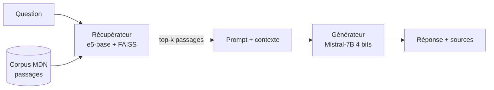
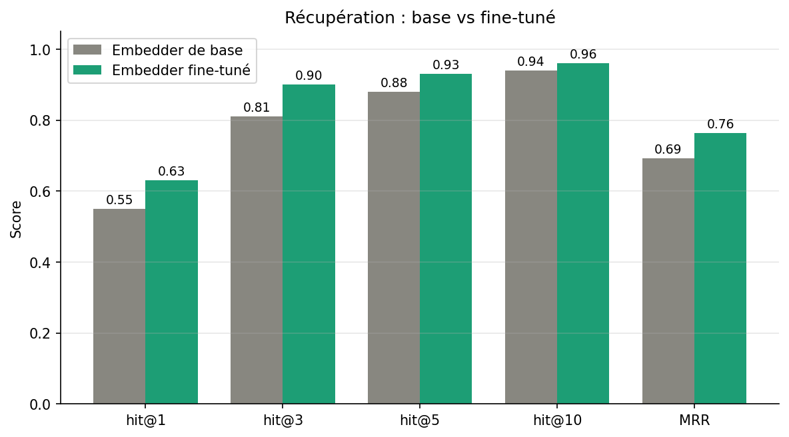

# Système RAG sur la documentation web MDN (français)

Projet du cours **Large Language Models** — ADEOTI Nihimath

Système de **Retrieval-Augmented Generation (RAG)** appliqué à la documentation
technique web de [MDN](https://developer.mozilla.org/fr/) en français. Le projet
compare un modèle de langage seul à un modèle augmenté par récupération, étudie
l'influence du nombre de passages récupérés, et mesure l'apport de la
spécialisation (fine-tuning) du modèle de récupération.


## 1. Cas d'usage et problématique

La documentation technique (HTML, CSS, JavaScript…) est volumineuse, précise et
en constante évolution. Un grand modèle de langage interrogé seul (*closed-book*)
répond à partir de sa seule mémoire paramétrique : il peut être imprécis,
daté, ou produire des réponses non vérifiables.

L'approche RAG consiste à **récupérer les passages les plus pertinents** dans une
base documentaire, puis à les fournir au modèle comme contexte pour qu'il rédige
une réponse ancrée dans des sources réelles.

Ce projet répond à trois questions :

1. **RAG vs closed-book**  le contexte récupéré améliore-t-il la qualité des réponses ?
2. **Effet de `k`** :combien de passages faut-il récupérer ?
3. **Récupérateur de base vs spécialisé** : fine-tuner l'*embedder* sur le domaine améliore-t-il la récupération, et par ricochet la génération ?


## 2. Architecture du système



- **Corpus** : documentation MDN française, nettoyée et découpée en passages (*chunks*).
- **Récupérateur** : encodage des passages avec un modèle d'*embeddings*, indexation vectorielle **FAISS**, recherche des `k` passages les plus proches d'une question.
- **Générateur** : **Mistral-7B-Instruct v0.3** quantifié en 4 bits, qui rédige la réponse à partir des passages récupérés.
- **Pipeline** : `question → récupération top-k → construction du prompt → génération`.


## 3. Structure du dépôt

```
systeme-rag/
├── ragdoc/                     # Package principal
│   ├── config.py               # Configuration (modèles, k, chemins, chunking…)
│   ├── retriever.py            # Récupérateur : embeddings + index FAISS
│   ├── generator.py            # Générateur : chargement + génération LLM
│   ├── pipeline.py             # Orchestration RAG (RagPipeline)
│   └── eval_set.py             # Construction du jeu d'évaluation
├── scripts/
│   ├── 01_build_corpus.py      # Corpus MDN : sparse-checkout + nettoyage + découpage
│   ├── 02_build_index.py       # Indexation FAISS (option --finetuned)
│   ├── 03_make_eval_set.py     # Génération du jeu d'évaluation (option -n)
│   ├── 04_run_evaluation.py    # Évaluation RAG vs closed-book (options --finetuned, --n_gen)
│   └── 05_finetune_embedder.py # Spécialisation de l'embedder (option --epochs)
├── data/                       # Données générées (voir notes ci-dessous)
│   └── eval_set.jsonl          # Jeu d'évaluation versionné (reproductibilité)
├── results/                    # Rapports d'évaluation et figures
│   ├── report_base.json
│   ├── report_finetuned.json
│   └── retrieval_base_vs_finetuned.png
├── ADEOTI_Nihimath_Systeme_RAG_LLM.ipynb                  # Notebook de démonstration de bout en bout
├── requirements.txt
└── README.md
```

> **Note sur les fichiers de `data/`.** Le corpus (`chunks.jsonl`), les index FAISS
> et l'embedder fine-tuné sont des fichiers volumineux **régénérés par les scripts** ;
> ils ne sont pas versionnés. Seul `eval_set.jsonl` est committé, car c'est lui qui
> garantit que l'évaluation est reproductible à l'identique.


## 4. Données
- **Source** : sous-ensemble de [MDN translated-content](https://github.com/mdn/translated-content),
  la documentation MDN traduite en français (contenu open source de Mozilla).
- **Récupération** (`scripts/01_build_corpus.py`) : *sparse-checkout* du dépôt MDN
  limité à trois dossiers, pour rester léger :
  - `files/fr/web/html`
  - `files/fr/web/css`
  - `files/fr/web/javascript/guide`
- **Nettoyage et découpage** : suppression du balisage et des éléments non textuels,
  puis découpage en passages de **~800 caractères** avec un **recouvrement de 120
  caractères** ; les passages de moins de **200 caractères** sont écartés.
- **Volume** : ~8 943 passages (`data/chunks.jsonl`).
- **Jeu d'évaluation** (`scripts/03_make_eval_set.py`) : paires
  *(question, réponse de référence, passage source)* générées à partir du corpus,
  enregistrées dans `data/eval_set.jsonl`. Ce fichier est versionné pour assurer
  la reproductibilité des métriques.

Les paramètres de découpage sont centralisés dans `ragdoc/config.py` (`ChunkConfig`).


## 5. Modèles utilisés

| Rôle | Modèle | Détail |
|------|--------|--------|
| Embedder de base | `intfloat/multilingual-e5-base` | Multilingue ; préfixes `query:` / `passage:` gérés dans `retriever.py` |
| Embedder spécialisé | `data/embedder_finetuned` | e5-base fine-tuné sur le domaine (`05_finetune_embedder.py`) |
| Générateur | `unsloth/mistral-7b-instruct-v0.3` | Chargé en **4 bits** (quantification bitsandbytes) |

Paramètres de génération : `temperature = 0.3`, `max_new_tokens = 256`.

> Toute la configuration des modèles est centralisée dans `ragdoc/config.py`
> (`ModelConfig`) : `generator_model = "unsloth/mistral-7b-instruct-v0.3"`,
> `load_in_4bit = True`, `embedding_model = "intfloat/multilingual-e5-base"`.


## 6. Installation

**Prérequis** : un GPU compatible CUDA avec au moins ~6 Go de VRAM (un **T4**,
comme sur Google Colab, suffit pour Mistral-7B en 4 bits).

```bash
git clone https://github.com/nihmad/systeme-rag.git
cd systeme-rag
pip install -r requirements.txt
```

> (Optionnel) Définir un jeton HuggingFace (`HF_TOKEN`) accélère les
> téléchargements de modèles et lève les limites de débit. L'authentification
> n'est pas obligatoire pour les modèles publics utilisés ici.


## 7. Reproduction étape par étape

Exécuter les scripts **dans l'ordre**, depuis la racine du dépôt.

```bash
# 1. Construire le corpus (sparse-checkout MDN + nettoyage + découpage)
python scripts/01_build_corpus.py

# 2. Indexer les passages avec l'embedder de base (FAISS)
python scripts/02_build_index.py

# 3. Générer le jeu d'évaluation (commencer petit avec -n pour tester)
python scripts/03_make_eval_set.py -n 100

# 4. Évaluer le système de base (RAG vs closed-book) -> results/report_base.json
python scripts/04_run_evaluation.py

# 5. Spécialiser l'embedder sur le domaine
python scripts/05_finetune_embedder.py --epochs 2

# 6. Réindexer avec l'embedder fine-tuné
python scripts/02_build_index.py --finetuned

# 7. Réévaluer le système spécialisé -> results/report_finetuned.json
python scripts/04_run_evaluation.py --finetuned --n_gen 30
```

L'option `--n_gen 30` limite l'évaluation de la **génération** à 30 exemples
(la génération LLM est coûteuse en temps), tandis que les métriques de
**récupération** sont calculées sur l'ensemble du jeu d'évaluation.

Le notebook `ADEOTI_Nihimath_Systeme_RAG_LLM.ipynb` reproduit ces étapes de bout en bout et fournit en plus
une **démonstration interactive** (interface Gradio) et le graphique comparatif.

## 8. Évaluation et métriques

**Récupération** (le bon passage est-il retrouvé ?)
- `hit@k` : proportion de questions dont le passage de référence figure dans les `k` premiers résultats.
- `MRR` (Mean Reciprocal Rank) : moyenne de l'inverse du rang du bon passage.

L'évaluation inclut une **ablation sur `k`** (valeurs `k ∈ {1, 3, 5, 10}`,
définies dans `RetrievalConfig`). Le pipeline utilise `top_k = 4` par défaut.

**Génération** (la réponse est-elle correcte ?)
- `EM` (Exact Match) : correspondance exacte avec la réponse de référence.
- `F1` : recouvrement de *tokens* entre la réponse générée et la référence.
- `ROUGE-L` : plus longue sous-séquence commune.

La génération est mesurée dans deux conditions : **RAG** (avec contexte récupéré)
et **closed-book** (LLM seul), afin d'isoler l'apport de la récupération.

---

## 9. Résultats

### Récupération

| Système | hit@1 | hit@3 | hit@5 | hit@10 | MRR |
|---------|------:|------:|------:|-------:|------:|
| Base | 0.55 | 0.81 | 0.88 | 0.94 | 0.692 |
| Fine-tuné | **0.63** | **0.90** | **0.93** | **0.96** | **0.764** |



### Génération (F1)

| Système | RAG | Closed-book |
|---------|----:|------------:|
| Base | 0.312 | 0.144 |
| Fine-tuné | 0.325 | 0.150 |

(Détails complets — EM, ROUGE-L, ablation sur `k` — dans `results/report_*.json`.)

---

## 10. Analyse et conclusions

**RAG vs closed-book.** Le résultat central : avec l'embedder de base, le F1
passe de 0.144 (closed-book) à 0.312 (RAG), soit **plus du double**. Fournir le
contexte récupéré améliore donc fortement la qualité des réponses par rapport à
la seule mémoire paramétrique du modèle. La récupération n'est pas décorative,
elle porte la performance.

**Apport de la spécialisation.** Le fine-tuning de l'embedder améliore la
récupération sur toute la ligne, surtout en haut du classement (`hit@1` : +8 pts,
`hit@3` : +9 pts, MRR : +7 pts) : le modèle spécialisé place plus souvent le bon
passage en première position. Les gains se resserrent à `hit@10` (effet plafond).
L'effet sur la génération end-to-end est positif mais modeste
(F1 0.312 → 0.325) : aux rangs effectivement utilisés, les deux récupérateurs
ramènent déjà souvent le bon passage, donc l'amélioration ne joue que sur les cas
limites.

**Limite de l'Exact Match.** L'EM est quasi nul partout : c'est attendu. Un LLM
génératif produit des phrases reformulées, pas des *spans* exacts ; l'EM est donc
peu adapté à la génération libre. Le F1 et le ROUGE-L sont ici plus pertinents.

**Perspectives.** Une évaluation sémantique (BERTScore, ou *LLM-as-judge*)
capturerait mieux la qualité réelle des réponses. Un *re-ranking* ou un seuil de
pertinence sur les passages récupérés réduirait les digressions observées sur les
questions très générales.

## 11. Démonstration interactive

Le notebook lance une interface **Gradio** permettant de poser des questions au
système et d'afficher la réponse générée ainsi que les passages sources récupérés.
Voir la dernière section de `ADEOTI_Nihimath_Systeme_RAG_LLM.ipynb`.
